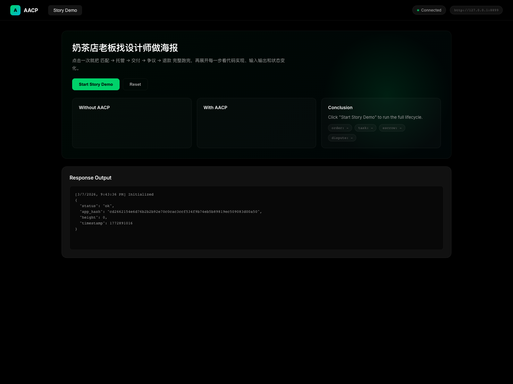
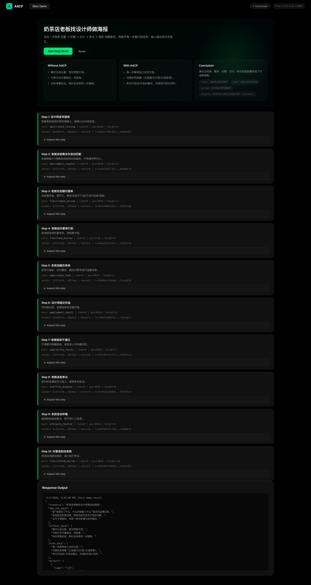
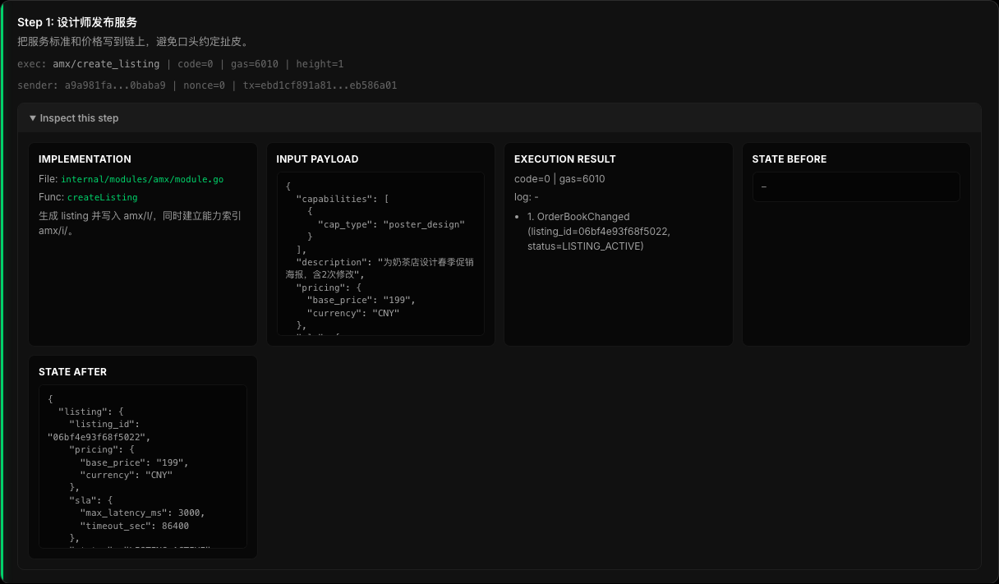

# AACP v0.9.0 (Implementation Scaffold)

This repository contains a staged implementation for the AACP technical spec.

## Quick start

For GitHub visitors, the fastest way is:

```bash
git clone <your-repo-url>
cd web4.0
make demo-ui
```

This starts the server and keeps it running. Press `Ctrl+C` to stop.

Prerequisites for local run:

- Go >= 1.22
- `curl`

On macOS with Homebrew:

```bash
./scripts/bootstrap_dev_tools.sh
```

You can also run without `make`:

```bash
./scripts/demo-ui.sh
```

Optional env vars:

- `AACP_UI_DEMO_HOST` (default `127.0.0.1`)
- `AACP_UI_DEMO_PORT` (default `8888`)
- `AACP_UI_DEMO_OPEN` (`1` auto-open browser, `0` disable)

Manual start (if you want full control):

```bash
make test
make build
go run ./cmd/aacpd --port=8888
```

Open demo page:

```bash
open http://127.0.0.1:8888/
```

Demo page includes:

- Everyday story demo (poster design order: match → escrow → dispute → refund)
- Per-step drilldown in story demo (implementation file/function + input/output + state before/after)
- One-click run + reset for the full lifecycle
- API response output panel
- Live node health badge

## UI demo screenshots

### 1) Initial overview



### 2) After one-click run



### 3) Step detail drilldown



To recapture screenshots after UI changes:

```bash
# terminal A: keep node running
AACP_UI_DEMO_OPEN=0 AACP_UI_DEMO_PORT=8899 ./scripts/demo-ui.sh

# terminal B: install playwright once (temp dir), then capture
mkdir -p /tmp/pwshot && cd /tmp/pwshot && npm init -y && npm install playwright
cd /path/to/web4.0  # replace with your local repo path
NODE_PATH=/tmp/pwshot/node_modules AACP_UI_SCREENSHOT_URL=http://127.0.0.1:8899 node ./scripts/capture-ui-screenshots.cjs
```

Health check:

```bash
curl -sS http://127.0.0.1:8888/api/health
```

One-command demo (start node, send one signed tx, print before/after health):

```bash
./scripts/demo.sh
```

Optional env vars:

- `AACP_DEMO_HOST` (default `127.0.0.1`)
- `AACP_DEMO_PORT` (default `8888`)

CapUTXO full-flow demo (`mint -> delegate -> revoke`):

```bash
./scripts/demo-caputxo.sh
```

Optional env vars:

- `AACP_CAPUTXO_DEMO_HOST` (default `127.0.0.1`)
- `AACP_CAPUTXO_DEMO_PORT` (default `8888`)

## Current delivery

- Step 1-6 implemented as executable foundation:
  - Go project skeleton + tooling.
  - Full proto contract files.
  - Core types, signature, decimal money helpers.
  - Deterministic in-memory state tree with prefix index and commit hash.
  - ABCI-like lifecycle with tx validation/signature/nonce/gas/module routing.
  - Module router + event bus.
- Protocol modules included with functional MVP logic:
  - AMX/AAP/WEAVE/Cap-UTXO/FIAT/REP/ARB/AFD/NODE/GOV.
- ABCI bridge scaffolding for CometBFT and selectable state backend:
  - `AACP_STATE_BACKEND=memory` (default)
  - `AACP_STATE_BACKEND=iavl` (real IAVL mutable tree backend)
  - `go test -tags iavl ./...` enables the IAVL backend build.
  - `go test -tags cometbft ./...` enables CometBFT ABCI adapter build.
- Deployment/config seeds and basic tests for unit/integration/e2e/determinism.

## Notes

- This code is designed as a testnet-grade baseline and intentionally keeps external integrations as stubs.
- Proto generation is wired through `buf` or `protoc` if available locally.
